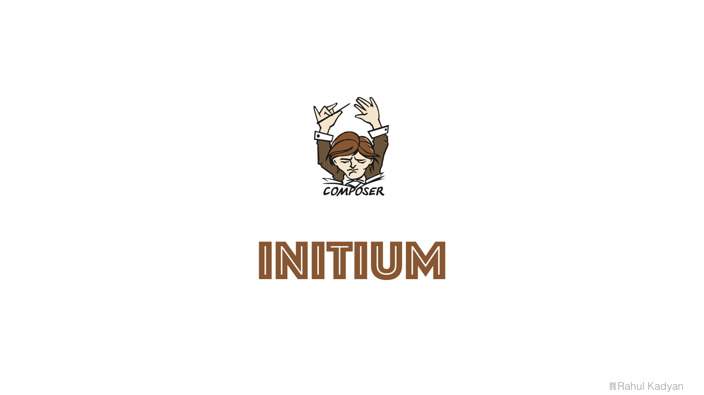

# initium

Start project with any repository!



<p align="center">
  <a href="https://styleci.io/repos/60205255">
    
  </a>
  <a href="https://circleci.com/gh/znck/initium">
    
  </a>
  <a href="https://coveralls.io/github/znck/initium?branch=master">
    
  </a>
  <a href="LICENSE">
    
  </a>
  <a href="https://packagist.org/packages/znck/initium">
    
  </a>
  <a href="https://github.com/znck/initium/releases">
    
  </a>

  <a href="https://github.com/znck/initium/issues">
    
  </a>
</p>

## Install

Via Composer

``` bash
$ composer global require znck/initium
```

## Usage

```bash
initium new <project-name> [<optional-skeleton-repository = default: znck/skeleton>]
```

## Create your own skeleton repository
`Initium` replaces all strings starting with semi-colon with user provided data.
Example: `:vendor/:project_name` will be replaced by variables named `[Vendor/Project Name]`

### Features
- For key `:project_name` value be `foo project` then:
    - `:Project_name` = `Foo project`
    - `:Project_Name` = `Foo Project`
    - `:PROJECT_NAME` = `FOO PROJECT`

## Change log

Please see [CHANGELOG](CHANGELOG.md) for more information what has changed recently.

## Testing

``` bash
$ composer test
```

## Contributing

Please see [CONTRIBUTING](CONTRIBUTING.md) and [CONDUCT](CONDUCT.md) for details.

## Security

If you discover any security related issues, please email hi@znck.me instead of using the issue tracker.

## Credits

- [Rahul Kadyan][link-author]
- [All Contributors][link-contributors]

## License

The MIT License (MIT). Please see [License File](LICENSE.md) for more information.

[link-author]: https://github.com/znck
[link-contributors]: ../../contributors
